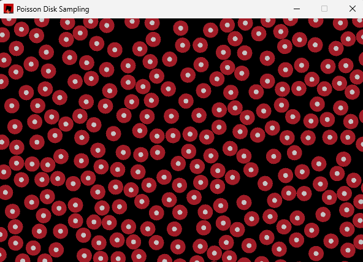

A small Rust program to generate points using Poisson disk sampling in a rectangular region.

Based on paper by Robert Bridson, University of British Columbia.

Fast Poisson Disk Sampling in Arbitrary Dimensions:
https://www.cs.ubc.ca/~rbridson/docs/bridson-siggraph07-poissondisk.pdf

Sample output from program:

.
